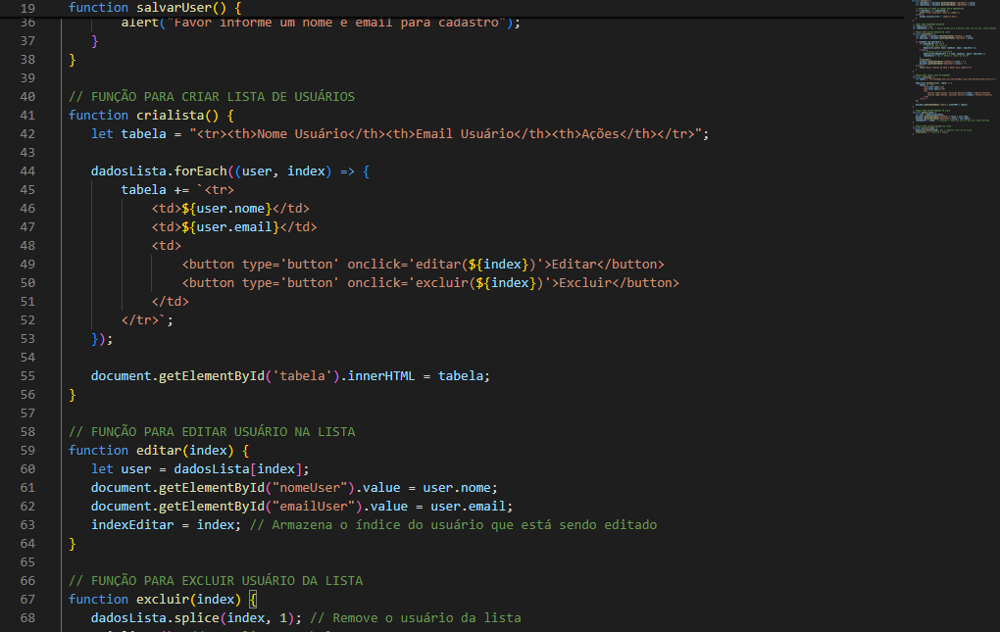
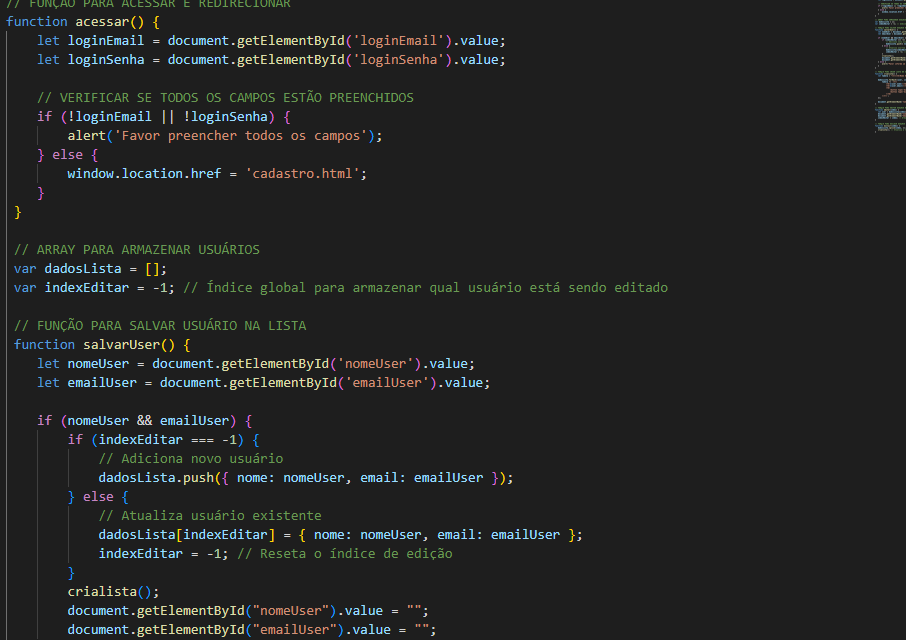

# README - Documentação do codigo javascript - Cadastro cad e Login cad. 🎲
- A função permite cadastrar novos usuários com nome, email e cpf ou editar os existentes, atualizando a lista de usuários exibida.
 
# SOBRE O JAVA 🖱
 
- O código utiliza JavaScript para controlar a interação do usuário com a página para verificar entradas, salvar dados e atualizar a interface de usuário.
 

 
# __________________________________________________________________________
 
 

# __________________________________________________________________________
 
# FUNCIONALIDADES🖥️
 
 **`acessar()`**: Verifica se os campos de email e senha foram preenchidos e redireciona o usuário para uma nova página (`cadastro.html`) caso os dados sejam válidos.
 
 **`salvarUser()`**: Salva ou atualiza as informações do usuário (nome e email) em uma lista.
 
 **`crialista()`**: Cria e exibe uma tabela HTML com os dados dos usuários cadastrados.
 
 **`editar(index)`**: Carrega as informações de um usuário específico para edição.
 
 **`excluir(index)`**: Remove um usuário da lista e atualiza a exibição da tabela.
 
 
 # __________________________________________________________________________
 
 # CADASTRO
 
 
# 🎮Tecnologias e Fontes Utilizadas:
 
HTML para a estrutura da página.
- JavaScript
- function
- vscode  
 
 
JavaScript para manipulação da lista de usuários e validação de acesso.
## 🚧 Fontes utilizadas
* [Mozilla](https://developer.mozilla.org/en-US/docs/Web/HTML/Element/form)- The Form Element.
* [Alura](https://www.alura.com.br/artigos/escrever-bom-readme)- Como Escrever um README Incrível no seu GitHub.
 
 # 💋AUTORES
 [ Ana Beatriz Silva.](https://github.com/biasantorii) |
| :---:
